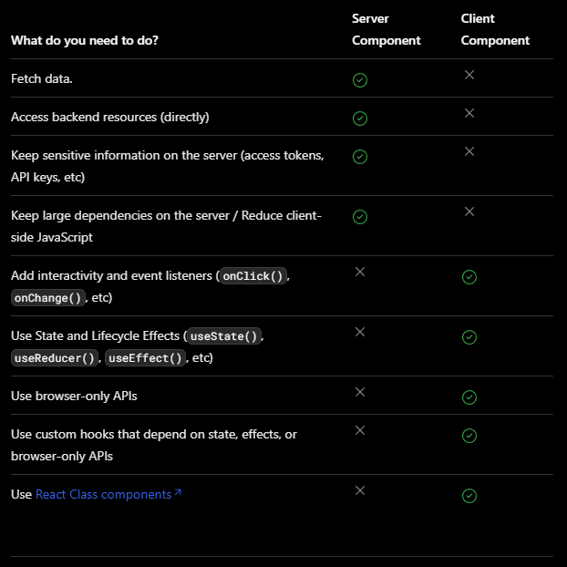

### React Essentials

Next.js를 사용하여 애플리케이션을 구축하기 위해서는 Server Components와 같은 React의 최신 기능에 익숙해지는 것이 도움이 됩니다. 이 페이지에서는 Server Components와 Client Components의 차이점, 언제 사용해야 하는지, 그리고 권장되는 패턴에 대해 알아보겠습니다.

React에 처음 접하신다면 React 문서를 참조하는 것도 좋은 방법입니다. 학습에 도움이 될 수 있는 몇 가지 좋은 자료를 소개해 드리겠습니다:

- https://react.dev/learn/tutorial-tic-tac-toe

- https://react.dev/learn/thinking-in-react

- https://react.dev/learn/describing-the-ui

***

#### Server Components

Server Components와 Client Components를 사용하면 개발자들은 서버와 클라이언트를 아우르는 애플리케이션을 구축할 수 있습니다. 이를 통해 클라이언트 측 애플리케이션의 풍부한 상호 작용성과 전통적인 서버 렌더링의 성능 향상을 결합할 수 있습니다.

#### Thinking in Sever Components

React가 UI를 구축하는 방식을 변경한 것처럼, React 서버 컴포넌트는 서버와 클라이언트를 활용하는 하이브리드 애플리케이션을 구축하기 위한 새로운 사고방식을 소개합니다.

단일 페이지 애플리케이션과 같이 React가 전체 애플리케이션을 클라이언트 측에서 렌더링하는 대신, React는 이제 컴포넌트의 목적에 따라 어디에서 렌더링할지 선택할 수 있는 유연성을 제공합니다.

예를들어 당신의 애플리케이션 페이지를 생각해봅시다.


만약 페이지를 더 작은 컴포넌트로 분할한다면, 대부분의 컴포넌트가 non-interactive 서버에서 Server Components로 렌더링될 수 있음을 알 수 있습니다. 작은 인터랙티브 UI 조각들에는 Client Components를 사용할 수 있습니다. 이는 Next.js의 서버 중심 접근 방식과 일치합니다.

#### Why Server Components?

서버 컴포넌트를 사용하는 이유에 대해 생각하실 수도 있습니다. 서버 컴포넌트를 사용하는 것이 Client Components에 비해 어떤 이점이 있는 걸까요?

서버 컴포넌트를 사용하면 개발자들은 서버 인프라를 더 효과적으로 활용할 수 있습니다. 예를 들어, 데이터 가져오기를 서버로 이동시켜 데이터베이스에 가까이 배치하고, 클라이언트 JavaScript 번들 크기에 영향을 미쳤던 큰 종속성을 서버에 유지함으로써 성능을 향상시킬 수 있습니다. 서버 컴포넌트를 사용하면 React 애플리케이션을 작성하는 데 있어 PHP나 Ruby on Rails와 유사한 느낌을 받을 수 있지만, React와 컴포넌트 기반 UI 템플릿의 강력함과 유연성을 가질 수 있습니다.

서버 컴포넌트를 사용하면 초기 페이지 로딩 속도가 빨라지고 클라이언트 측 JavaScript 번들 크기가 감소합니다. 기본 클라이언트 측 런타임은 캐시 가능하며 크기가 예측 가능하며, 애플리케이션이 커져도 증가하지 않습니다. 추가적인 JavaScript는 Client Components를 통해 애플리케이션에서 클라이언트 측 상호 작용이 사용될 때만 추가됩니다.

Next.js로 라우트를 로드할 때, 초기 HTML이 서버에서 렌더링됩니다. 이 HTML은 이후 브라우저에서 점진적으로 향상되며, 클라이언트가 애플리케이션을 인터랙티브하게 가져가기 위해 Next.js와 React 클라이언트 측 런타임을 비동기적으로 로드합니다.

서버 컴포넌트로의 전환을 쉽게 하기 위해 App Router 내부의 모든 컴포넌트는 기본적으로 서버 컴포넌트입니다. 특수 파일과 함께 배치된 컴포넌트도 포함됩니다. 이를 통해 추가적인 작업 없이 자동으로 서버 컴포넌트를 채택하고, 즉시 탁월한 성능을 얻을 수 있습니다. 또한 'use client' 지시문을 사용하여 선택적으로 클라이언트 컴포넌트를 사용할 수도 있습니다.

***

#### Client Components

클라이언트 컴포넌트를 사용하면 애플리케이션에 클라이언트 측 상호 작용을 추가할 수 있습니다. Next.js에서는 이러한 컴포넌트를 서버에서 사전 렌더링한 후 클라이언트에서 실행됩니다. Pages Router의 컴포넌트가 작동하는 방식과 유사하게 클라이언트 컴포넌트를 생각할 수 있습니다.

#### The "use client" directive

"use client" 지시문은 서버 컴포넌트와 클라이언트 컴포넌트 간의 모듈 그래프 경계를 선언하는 규칙입니다.

```
app/count.tsx

'use client'
 
import { useState } from 'react'
 
export default function Counter() {
  const [count, setCount] = useState(0)
 
  return (
    <div>
      <p>You clicked {count} times</p>
      <button onClick={() => setCount(count + 1)}>Click me</button>
    </div>
  )
}
```

```
app/counter.js

'use client'
 
import { useState } from 'react'
 
export default function Counter() {
  const [count, setCount] = useState(0)
 
  return (
    <div>
      <p>You clicked {count} times</p>
      <button onClick={() => setCount(count + 1)}>Click me</button>
    </div>
  )
}
```


`use client`은 서버 전용 코드와 클라이언트 코드 사이에 위치합니다. 이는 파일의 맨 위에 위치하며, import 위에 배치되어 서버 전용 부분에서 클라이언트 부분으로의 경계를 정의합니다. `use client`가 파일에서 정의되면, 해당 파일로 import된 다른 모든 모듈(하위 컴포넌트 포함)은 클라이언트 번들의 일부로 간주됩니다.

서버 컴포넌트가 기본값이므로, `use client` 지시문으로 시작하는 모듈에서 정의되거나 import되지 않은 경우, 모든 컴포넌트는 서버 컴포넌트 모듈 그래프의 일부입니다.

```
good to know:

- 서버 컴포넌트 모듈 그래프의 컴포넌트는 서버에서만 렌더링됩니다.
- 클라이언트 컴포넌트 모듈 그래프의 컴포넌트는 주로 클라이언트에서 렌더링되지만, Next.js에서는 서버에서 사전 렌더링되어 클라이언트에서 실행될 수도 있습니다.
- `use client` 지시문은 import 이전에 파일의 맨 위에서 정의되어야 합니다.
- 모든 파일에 "use client"를 정의할 필요는 없습니다. 클라이언트 모듈 경계는 "진입점"에서 한 번만 정의하면, 해당 모듈로 import된 모든 모듈이 클라이언트 컴포넌트로 간주됩니다.
```

***

#### When to use Server and Client Components?

서버 컴포넌트와 클라이언트 컴포넌트 사이의 결정을 간소화하기 위해, 클라이언트 컴포넌트를 사용할 필요가 있는 경우를 제외하고는 서버 컴포넌트(앱 디렉토리의 기본값)를 사용하는 것을 권장합니다.



#### Patterns

#### Moving Client Components to the Leaves

애플리케이션의 성능을 개선하기 위해, 가능한 경우 클라이언트 컴포넌트를 컴포넌트 트리의 최하위에 배치하는 것을 권장합니다.

예를 들어, 로고, 링크 등 정적 요소를 포함하는 레이아웃과 상태를 사용하는 상호작용 가능한 검색 바가 있는 레이아웃이 있다고 가정해봅시다.

레이아웃 전체를 클라이언트 컴포넌트로 만드는 대신, 상호작용 로직을 클라이언트 컴포넌트로 이동시키고 (예: `<SearchBar />`), 레이아웃은 서버 컴포넌트로 유지합니다. 이렇게 하면 레이아웃의 모든 컴포넌트 JavaScript를 클라이언트로 보내지 않아도 됩니다.

```
app/layout.tsx

// SearchBar is a Client Component
import SearchBar from './searchbar'

// Logo is a Server Component
import Logo from './logo'
 
// Layout is a Server Component by default

export default function Layout({ children }: { children: React.ReactNode }) {
  return (
    <>
      <nav>
        <Logo />
        <SearchBar />
      </nav>
      <main>{children}</main>
    </>
  )
}
```

```
app/layout.js

// SearchBar is a Client Component
import SearchBar from './searchbar'

// Logo is a Server Component
import Logo from './logo'
 
// Layout is a Server Component by default
export default function Layout({ children }) {
  return (
    <>
      <nav>
        <Logo />
        <SearchBar />
      </nav>
      <main>{children}</main>
    </>
  )
}
```

#### Composing Client and Server Components

서버 컴포넌트와 클라이언트 컴포넌트는 동일한 컴포넌트 트리에서 결합할 수 있습니다.

내부적으로 React는 다음과 같은 방식으로 렌더링을 처리합니다:

- 서버에서는 React가 모든 서버 컴포넌트를 렌더링한 다음 결과를 클라이언트로 전송합니다.
    - 이 과정에서 클라이언트 컴포넌트 내부에 중첩된 서버 컴포넌트도 포함됩니다.
    - 이 단계에서는 클라이언트 컴포넌트는 건너뜁니다.
- 클라이언트에서는 React가 클라이언트 컴포넌트를 렌더링하고, 서버 컴포넌트의 렌더링 결과를 클라이언트 컴포넌트에 병합하여 서버와 클라이언트에서 수행된 작업을 통합합니다.
    - 클라이언트 컴포넌트 내에 서버 컴포넌트가 중첩되어 있는 경우, 해당 컴포넌트의 렌더링된 내용은 올바르게 클라이언트 컴포넌트 내에 배치됩니다.


``` 
Good to know: 

 Next.js에서는 초기 페이지 로드 중에 위 단계에서의 서버 컴포넌트의 렌더링 결과와 
 클라이언트 컴포넌트가 서버에서 HTML로 사전 렌더링되어 초기 페이지 로드 속도를 더 빠르게 만듭니다.
```

#### Nesting Server Components inside Client Components

서버 컴포넌트를 클라이언트 컴포넌트로 가져오는 것은 지원되지 않습니다. 이러한 접근 방식은 추가적인 서버 라운드트립을 필요로하기 때문에 제한이 있습니다.

**지원되지 않는 패턴: 서버 컴포넌트를 클라이언트 컴포넌트로 가져오는 것**

다음과 같은 패턴은 지원되지 않습니다. 즉, 서버 컴포넌트를 클라이언트 컴포넌트로 가져올 수 없습니다.

```
app/example-client-component.js

'use client'
 
// This pattern will **not** work!
// You cannot import a Server Component into a Client Component.
import ExampleServerComponent from './example-server-component'
 
export default function ExampleClientComponent({ children }) {
  const [count, setCount] = useState(0)
 
  return (
    <>
      <button onClick={() => setCount(count + 1)}>{count}</button>
 
      <ExampleServerComponent />
    </>
  )
}
```

```
app/example-client-component.tsx

'use client'
 
// This pattern will **not** work!
// You cannot import a Server Component into a Client Component.
import ExampleServerComponent from './example-server-component'
 
export default function ExampleClientComponent({
  children,
}: {
  children: React.ReactNode
}) {
  const [count, setCount] = useState(0)
 
  return (
    <>
      <button onClick={() => setCount(count + 1)}>{count}</button>
 
      <ExampleServerComponent />
    </>
  )
}
```

**권장되는 패턴: 서버 컴포넌트를 프롭스로 클라이언트 컴포넌트에 전달하기**

대신, 클라이언트 컴포넌트를 설계할 때 React props를 사용하여 서버 컴포넌트에 대한 "빈 공간"을 표시할 수 있습니다.

`서버 컴포넌트는 서버에서 렌더링되고, 클라이언트 컴포넌트가 클라이언트에서 렌더링될 때 "빈 공간"은 서버 컴포넌트의 렌더링된 결과로 채워집니다.`

일반적인 패턴은 React children prop을 사용하여 "빈 공간"을 생성하는 것입니다. 우리는 `<ExampleClientComponent>`를 일반적인 children 프롭을 받도록 리팩토링할 수 있으며, `<ExampleClientComponent>`의 가져오기(import)와 명시적인 중첩을 상위 컴포넌트로 이동시킬 수 있습니다.

```
app/example-client-component.tsx

'use client'
 
import { useState } from 'react'
 
export default function ExampleClientComponent({
  children,
}: {
  children: React.ReactNode
}) {
  const [count, setCount] = useState(0)
 
  return (
    <>
      <button onClick={() => setCount(count + 1)}>{count}</button>
 
      {children}
    </>
  )
}
```

```
app/example-client-component.js

'use client'
 
import { useState } from 'react'
 
export default function ExampleClientComponent({ children }) {
  const [count, setCount] = useState(0)
 
  return (
    <>
      <button onClick={() => setCount(count + 1)}>{count}</button>
 
      {children}
    </>
  )
}
```

이제 `<ExampleClientComponent>`는 children이 무엇인지를 알지 못합니다. 사실, `<ExampleClientComponent>`의 관점에서는 children이 결국 서버 컴포넌트의 결과로 채워질 것임도 알지 못합니다.

`<ExampleClientComponent>`의 유일한 책임은 어떤 children이 최종적으로 채워질지를 결정하는 것입니다.

부모 서버 컴포넌트에서는 `<ExampleClientComponent>`와 `<ExampleServerComponent>`를 모두 가져온 다음 `<ExampleServerComponent>`를 `<ExampleClientComponent>`의 자식으로 전달할 수 있습니다:

```
app/page.js

// This pattern works:
// You can pass a Server Component as a child or prop of a
// Client Component.
import ExampleClientComponent from './example-client-component'
import ExampleServerComponent from './example-server-component'
 
// Pages in Next.js are Server Components by default
export default function Page() {
  return (
    <ExampleClientComponent>
      <ExampleServerComponent />
    </ExampleClientComponent>
  )
}
```

```
app/page.tsx

// This pattern works:
// You can pass a Server Component as a child or prop of a
// Client Component.
import ExampleClientComponent from './example-client-component'
import ExampleServerComponent from './example-server-component'
 
// Pages in Next.js are Server Components by default
export default function Page() {
  return (
    <ExampleClientComponent>
      <ExampleServerComponent />
    </ExampleClientComponent>
  )
}
```

이 접근 방식을 사용하면 `<ExampleClientComponent>`와 `<ExampleServerComponent>`의 렌더링이 분리되어 독립적으로 렌더링될 수 있습니다. 이는 서버 컴포넌트가 클라이언트 컴포넌트보다 먼저 서버에서 렌더링되는 서버 컴포넌트와 일치합니다.

```
Good to know:

- 이 패턴은 이미 레이아웃과 페이지에서 children 프롭을 사용하여 적용되므로 추가적인 래퍼 컴포넌트를 생성할 필요가 없습니다.
- React 컴포지션 모델의 일부로 React 컴포넌트(JSX)를 다른 컴포넌트로 전달하는 것은 새로운 개념이 아닙니다.
- 이 컴포지션 전략은 컴포넌트가 전달받은 프롭이 무엇인지를 알지 못하기 때문에 서버와 클라이언트 컴포넌트 전체에서 작동합니다. 프롭을 전달받은 컴포넌트는 전달받은 것을 어디에 배치해야 하는지에 대해서만 책임을 지게 됩니다.
    - 이로써 전달받은 프롭은 독립적으로 렌더링될 수 있으며, 이 경우에는 클라이언트에서 렌더링되는 클라이언트 컴포넌트보다 훨씬 이전에 서버에서 렌더링됩니다.
    - "컨텐츠를 위로 올리는" 동일한 전략은 부모 컴포넌트에서 상태 변경으로 인해 가져온 중첩된 자식 컴포넌트의 다시 렌더링을 피하는 데 사용되었습니다.
- children 프롭에 제한되지 않습니다. JSX를 전달하기 위해 어떤 프롭이든 사용할 수 있습니다.
```

#### Passing props from Server to Client Components (Serialization)

서버에서 클라이언트 컴포넌트로 전달되는 프롭은 직렬화 가능해야 합니다. 이는 함수, 날짜 등과 같은 값들을 직접적으로 클라이언트 컴포넌트로 전달할 수 없음을 의미합니다.

```
Where is the Network Boundary?

네트워크 경계(Network Boundary)는 App Router에서 Server Components와 
Client Components 사이에 위치합니다. 

이는 페이지(Pages)에서 `getStaticProps/getServerSideProps`와 
페이지 컴포넌트(Page Components) 사이의 경계와는 다릅니다. 

Server Components 내에서 가져온 데이터는 클라이언트 컴포넌트로 전달되지 않는 한 
네트워크 경계를 넘어가지 않기 때문에 직렬화할 필요가 없습니다. 
Server Components와 데이터 가져오기에 관해 더 자세히 알아보세요.
```

#### Keeping Server-Only Code out of Client Components (Poisoning)

클라이언트 컴포넌트와 서버 컴포넌트 간에 JavaScript 모듈을 공유할 수 있기 때문에, 원래 서버에서만 실행되기를 의도한 코드가 클라이언트로 sneaking하는 경우가 발생할 수 있습니다.

예를 들어, 다음과 같은 데이터 가져오기 함수를 살펴보겠습니다:

```
lib/data.tsx

export async function getData() {
  const res = await fetch('https://external-service.com/data', {
    headers: {
      authorization: process.env.API_KEY,
    },
  })
 
  return res.json()
}
```

```
lib/data.js

export async function getData() {
  const res = await fetch('https://external-service.com/data', {
    headers: {
      authorization: process.env.API_KEY,
    },
  })
  return res.json()
}
```

초기에는 `getData`가 서버와 클라이언트에서 모두 작동하는 것처럼 보입니다. 하지만 `NEXT_PUBLIC` 접두사가 없는 `API_KEY` 환경 변수는 서버에서만 액세스할 수 있는 개인 변수입니다. Next.js는 클라이언트 코드에서 안전한 정보 누출을 방지하기 위해 개인 환경 변수를 빈 문자열로 대체합니다.

결과적으로, `getData()`는 클라이언트에서 가져와 실행할 수 있지만, 예상대로 작동하지 않습니다. 그리고 변수를 공개로 만들면 함수는 클라이언트에서 작동하지만, 민감한 정보가 누출될 수 있습니다.

따라서 이 함수는 항상 서버에서만 실행되도록 작성된 것입니다.

#### The server only package

서버 코드가 클라이언트 측에서의 의도치 않은 사용을 방지하기 위해, `server-only` 패키지를 사용할 수 있습니다. 이 패키지는 서버에서만 실행되어야 하는 모듈이 실수로 클라이언트 컴포넌트로 잘못 가져와질 때 빌드 시간에 오류를 발생시킵니다.

server only 패키지를 이용하기 위해서는 우선, 아래의 패키지를 설치합니다.

```
Terminal
npm install server-only
```


그리고나서 server-only code가 있는 아무 모듈에 import 하세요

```
import 'server-only'
 
export async function getData() {
  const res = await fetch('https://external-service.com/data', {
    headers: {
      authorization: process.env.API_KEY,
    },
  })
 
  return res.json()
}

```

이제 `getData()`를 가져오는 모든 Client Component는 빌드 시간 오류를 받게 되며, 
이 모듈은 서버에서만 사용할 수 있다는 설명이 제공됩니다.

`client-only` 패키지는 클라이언트 전용 코드를 포함하는 모듈에 표시하는 데 사용할 수 있습니다. 
예를 들어, window 객체에 액세스하는 코드와 같은 클라이언트 전용 코드입니다.

#### Data Fetching

Client Component에서 데이터를 가져올 수는 있지만, 데이터를 가져오는 경우에는 특별한 이유가 없는 한 Server Component에서 데이터를 가져오는 것을 권장합니다. 데이터 가져오기를 서버로 이동하면 성능과 사용자 경험이 향상됩니다.

#### Third-party packages

서버 컴포넌트는 새로운 개념이기 때문에, ecosystem의 타사 패키지들은 useState, useEffect, createContext와 같은 클라이언트 전용 기능을 사용하는 컴포넌트에 `use client` 지시문을 추가하기 시작한 지 얼마되지 않았습니다.

현재 많은 npm 패키지의 컴포넌트들은 아직 이 지시문을 포함하고 있지 않습니다. 이러한 타사 컴포넌트는 자체 Client Component 내에서는 예상대로 작동하지만, Server Component 내에서는 작동하지 않을 것입니다.

예를 들어, 가상의 acme-carousel 패키지를 설치했다고 가정해 봅시다. 이 패키지에는 `<Carousel />` 컴포넌트가 있으며, 이 컴포넌트는 useState를 사용하지만 
아직 `use client` 지시문이 포함되어 있지 않습니다.

`<Carousel />`을 Client Component 내에서 사용한다면 예상대로 작동할 것입니다.

```
app/gallery.js

'use client'
 
import { useState } from 'react'
import { Carousel } from 'acme-carousel'
 
export default function Gallery() {
  let [isOpen, setIsOpen] = useState(false)
 
  return (
    <div>
      <button onClick={() => setIsOpen(true)}>View pictures</button>
 
      {/*  Works, since Carousel is used within a Client Component */}
      {isOpen && <Carousel />}
    </div>
  )
}
```
하지만 서버 컴포넌트 안에서 사용하려 한다면 에러가 발생할겁니다.

```
app.page.js

import { Carousel } from 'acme-carousel'
 
export default function Page() {
  return (
    <div>
      <p>View pictures</p>
 
      {/*  Error: `useState` can not be used within Server Components */}
      <Carousel />
    </div>
  )
}
```

이것은 Next.js가 `<Carousel />`이 클라이언트 전용 기능을 사용하고 있음을 알지 못하기 때문입니다.

이를 해결하기 위해 타사 컴포넌트를 사용하는 경우에는 해당 컴포넌트를 자체 Client Component로 감싸주면 됩니다:

```
app/carousel.js

'use client'
 
import { Carousel } from 'acme-carousel'
 
export default Carousel
```

이제 `<carousel />`을 서버컴포넌트 안에서 사용할 수 있습니다.

```
app/page.js

import Carousel from './carousel'
 
export default function Page() {
  return (
    <div>
      <p>View pictures</p>
 
      {/*  Works, since Carousel is a Client Component */}
      <Carousel />
    </div>
  )
}
```

일반적으로 대부분의 타사 컴포넌트는 클라이언트 컴포넌트 내에서 사용할 것이므로, 해당 컴포넌트를 감싸는 작업이 필요하지 않을 것으로 예상됩니다. 하지만 예외적으로 프로바이더 컴포넌트는 React 상태와 컨텍스트에 의존하며 일반적으로 애플리케이션의 루트에서 필요합니다. 아래에서 타사 컨텍스트 프로바이더에 대해 자세히 알아보세요.

##### Library Authors

- 비슷한 방식으로, 다른 개발자들이 사용할 패키지를 작성하는 라이브러리 제작자는 
`use client` 지시문을 사용하여 패키지의 클라이언트 진입점을 표시할 수 있습니다. 
이를 통해 패키지 사용자들은 패키지 컴포넌트를 직접 Server 컴포넌트에 가져오기 위해 
감싸는 경계를 만들지 않아도 됩니다.

- 패키지를 최적화하기 위해 `use client`를 트리의 깊은 곳에서 사용할 수도 있으며, 이를 통해 가져온 모듈들이 Server 컴포넌트 모듈 그래프의 일부가 될 수 있습니다.
참고로, 일부 번들러는 `use client` 지시문을 제거할 수 있습니다. esbuild를 설정하여 `use client` 지시문을 포함시키는 방법에 대한 예제는 React Wrap Balancer 및 Vercel Analytics 리포지토리에서 찾을 수 있습니다.

#### Context

대부분의 React 애플리케이션은 createContext를() 통해 직접적으로 또는 제3자 라이브러리에서 가져온 provider 컴포넌트를 통해 컴포넌트간에 데이터를 공유하기 위해 Context(https://react.dev/reference/react/useContext)를 활용합니다.

Next.js 13에서 컨텍스트는 `Client 컴포넌트 내에서 완전히 지원됩니다. 하지만 Server 컴포넌트 내에서 직접 생성하거나 사용할 수는 없습니다.` 이는 Server 컴포넌트가 상호작용을 하지 않기 때문에 React 상태가 없기 때문이며, 컨텍스트는 주로 일부 React 상태가 업데이트된 후 트리의 깊은 곳에 있는 상호작용 컴포넌트를 다시 렌더링하기 위해 사용됩니다.

Server 컴포넌트 간에 데이터를 공유하기 위한 대체 방법에 대해서는 나중에 알아보도록 하겠습니다. 먼저, Client 컴포넌트 내에서 컨텍스트를 사용하는 방법을 살펴보겠습니다.

##### Using context in Client Components

모든 context API들은 Client 컴포넌트에서 지원됩니다.

```
app/sidebar.js

'use client'
 
import { createContext, useContext, useState } from 'react'
 
const SidebarContext = createContext()
 
export function Sidebar() {
  const [isOpen, setIsOpen] = useState()
 
  return (
    <SidebarContext.Provider value={{ isOpen }}>
      <SidebarNav />
    </SidebarContext.Provider>
  )
}
 
function SidebarNav() {
  let { isOpen } = useContext(SidebarContext)
 
  return (
    <div>
      <p>Home</p>
 
      {isOpen && <Subnav />}
    </div>
  )
}
```

그러나 컨텍스트 프로바이더는 일반적으로 애플리케이션의 루트 근처에서 렌더링되어 현재 테마와 같은 전역적인 관심사를 공유하는 데 사용됩니다. 하지만 컨텍스트는 Server Components에서 지원되지 않기 때문에 애플리케이션의 루트에서 컨텍스트를 생성하려고 하면 오류가 발생합니다.

```
app/layout.js

import { createContext } from 'react'
 
//  createContext is not supported in Server Components
export const ThemeContext = createContext({})
 
export default function RootLayout({ children }) {
  return (
    <html>
      <body>
        <ThemeContext.Provider value="dark">{children}</ThemeContext.Provider>
      </body>
    </html>
  )
}
```

이를 해결하기 위해 컨텍스트를 생성하고 해당 프로바이더를 Client Component 내에서 렌더링하십시오.

```
app/theme-provider.js

'use client'
 
import { createContext } from 'react'
 
export const ThemeContext = createContext({})
 
export default function ThemeProvider({ children }) {
  return <ThemeContext.Provider value="dark">{children}</ThemeContext.Provider>
}
```

이제 Server Component에서도 프로바이더를 직접 렌더링할 수 있게 되었습니다. 이 프로바이더는 Client Component로 표시되었기 때문입니다.

```
app/layout.js

import ThemeProvider from './theme-provider'
 
export default function RootLayout({ children }) {
  return (
    <html>
      <body>
        <ThemeProvider>{children}</ThemeProvider>
      </body>
    </html>
  )
}
```
루트에 렌더링된 프로바이더를 통해 앱의 모든 다른 Client Component에서 이 컨텍스트를 사용할 수 있습니다.

```
Good to know: 

가능한 깊이까지 프로바이더를 렌더링해야 합니다. 
ThemeProvider가 전체 <html> 문서를 감싸는 대신 {children}만 감싸는 것에 유의하세요. 
이렇게 하면 Next.js가 Server Component의 정적 부분을 최적화하기가 더 쉬워집니다.

```

#### Rendering third-party context providers in Server Components

서드파티 npm 패키지는 종종 애플리케이션의 루트 근처에 렌더링되어야 하는 프로바이더를 포함하고 있습니다. 이러한 프로바이더가 `use client` 지시문을 포함하고 있다면, 서버 컴포넌트 내부에서 직접 렌더링할 수 있습니다. 하지만, 서버 컴포넌트가 매우 새로운 개념이기 때문에, 많은 서드파티 프로바이더는 아직 해당 지시문을 추가하지 않았을 것입니다.

만약 `use client` 지시문이 없는 서드파티 프로바이더를 렌더링하려고 한다면, 에러가 발생합니다.

```
app/provider.js

import { ThemeProvider } from 'acme-theme'
 
export default function RootLayout({ children }) {
  return (
    <html>
      <body>
        {/*  Error: `createContext` can't be used in Server Components */}
        <ThemeProvider>{children}</ThemeProvider>
      </body>
    </html>
  )
}
```

수정하려면 서드파티 프로바이더를 클라이언트 컴포넌트로 감싸야합니다.

```
app/provider.js

'use client'
 
import { ThemeProvider } from 'acme-theme'
import { AuthProvider } from 'acme-auth'
 
export function Providers({ children }) {
  return (
    <ThemeProvider>
      <AuthProvider>{children}</AuthProvider>
    </ThemeProvider>
  )
}
```
이제 `<Providers />`를 가져와서 루트 레이아웃 안에서 직접 렌더링할 수 있습니다.

```
app/layout.js

import { Providers } from './providers'
 
export default function RootLayout({ children }) {
  return (
    <html>
      <body>
        <Providers>{children}</Providers>
      </body>
    </html>
  )
}
```
루트에 렌더링된 프로바이더들로 인해, 이러한 라이브러리의 모든 컴포넌트와 훅들은 사용자의 클라이언트 컴포넌트 내에서 예상대로 작동할 것입니다.

서드파티 라이브러리가 자신의 클라이언트 코드에 `use client`를 추가한 경우, 래퍼 클라이언트 컴포넌트를 제거할 수 있게 될 것입니다.

##### Sharing data between Server Components

서버 컴포넌트는 인터랙티브하지 않으며 따라서 React 상태를 읽지 않기 때문에 데이터를 공유하기 위해 React 컨텍스트를 사용할 필요가 없습니다. 대신, 여러 서버 컴포넌트가 접근해야 하는 공통 데이터에 대해 네이티브 JavaScript 패턴을 사용할 수 있습니다. 예를 들어, 모듈을 사용하여 여러 컴포넌트 간에 데이터베이스 연결을 공유할 수 있습니다.

```
utils/database.js

export const db = new DatabaseConnection()
```

```
app/users/layout.js

import { db } from '@utils/database'
 
export async function UsersLayout() {
  let users = await db.query()
  // ...
}
```

```
app/users/[id]/page.js

import { db } from '@utils/database'
 
export async function DashboardPage() {
  let user = await db.query()
  // ...
}
```
위의 예제에서 레이아웃과 페이지는 모두 데이터베이스 쿼리를 수행해야 합니다. 이러한 컴포넌트들은 `@utils/database` 모듈을 import하여 데이터베이스에 접근을 공유합니다. 이 JavaScript 패턴은 global singletons이라고 불립니다.

##### Sharing fetch requests between Server Components

데이터를 가져올 때 페이지나 레이아웃과 그 하위 컴포넌트 간에 가져온 데이터를 공유하고 싶을 수 있습니다. 이는 컴포넌트들 간의 불필요한 결합을 일으킬 수 있으며, 컴포넌트 간에 props 주고받는 것으로 이어질 수 있습니다.

대신, 데이터를 소비하는 컴포넌트와 데이터 가져오기를 함께 위치시키는 것을 권장합니다. `Server Components에서 fetch 요청`(https://nextjs.org/docs/app/building-your-application/data-fetching#automatic-fetch-request-deduping)은 자동으로 중복 제거되므로 각 route segment는 중복 요청에 대해 걱정할 필요 없이 정확히 필요한 데이터를 요청할 수 있습니다. Next.js는 fetch 캐시에서 동일한 값을 읽게 됩니다.

